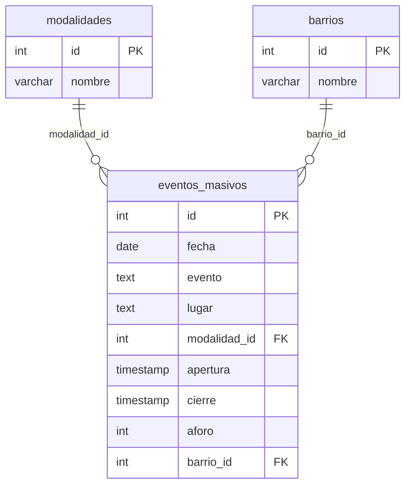

# Mágica Ciudad de Buenos Aires — Eventos Masivos

## Introducción

¡Pasan muchas cosas en la ciudad de buenos aires! Y si hacés un evento masivo, tenés que pedir permiso al gobierno de la ciudad de buenos aires. Contamos con esos datos para los años 2024, 2025 y 2026.

## DER

## Consigna

1. Crear una nueva base de datos en Neon DB
2. Clonar el repositorio. Hacer `npm install` para instalar las dependencias.
3. Conectarla con nuestro programa usan la librería pg. Está el esqueleto en `main.js`.
4. Poblar la BDD con los datos. Para eso, cuentan con la función `resetearBDD()` que pueden importar. **OJO:** Es una función asíncrona, así que no se olviden de usar `await` al llamarla.
5. Hacer consultas a la base de datos para responder las siguientes preguntas:

- Listar todos los eventos del dia 2024-01-06.
- Borrar todos los eventos de parque de la ciudad.
- Modificar el aforo del burger fest a 4000.
- Insertar nuevamente con fecha de hoy el evento con mas aforo. (2 queries).
- Obtener los 5 barrios con más eventos (nombre, cantidad).

No se preocupen si se la mandan con las queries: resetear la base de datos la deja nuevita nuevita.
